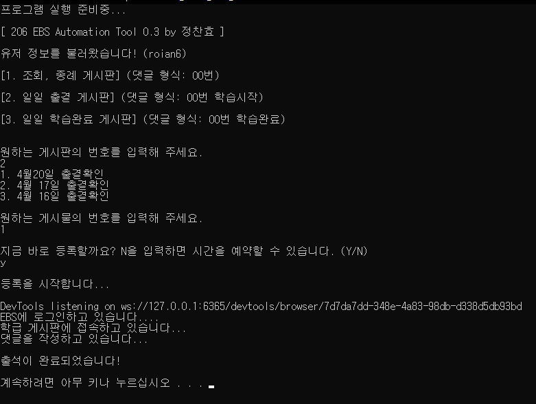

## 프로젝트 소개
2학년 6반 온라인 클래스의 **아주 복잡한** 출석체크 과정을 혁신적으로 단축시켜주는 프로그램입니다.

## 새로운 기능
### 0.3
- 클래스 보안 강화로 프로그램이 종료되던 이슈를 수정했습니다. (bs4 ua 우회)
- 이제 조회/종례 게시판 기능을 함께 제공합니다!
### 0.2
- 이제 학습완료 게시판 기능을 함께 제공합니다!

## 주요 기능
- **엔터키 세번만** 누르면 출석체크가 됩니다.
- 유저 정보가 자동으로 로컬에 저장됩니다.
- 특정 시간에 출석을 예약할 수 있습니다. - **사용하지 말 것**
- 출석이 완료되면 스크린샷을 찍어서 보여줍니다.

## 사용 방법
1. `206_Online_Class_0.3.exe`를 다운로드합니다.
2. `chrome://version`에서 내 크롬 버전을 확인합니다. (79, 80, 81 중 하나일 것임.)
3. 레포지토리의 `driver_xx` 폴더에서 버전에 맞는 크롬 드라이버를 다운로드합니다. [없으면 여기로](https://sites.google.com/a/chromium.org/chromedriver/home)
4. `206_Online_Class_0.3.exe`를 `chromedriver.exe`와 같은 폴더에 넣고, 실행합니다.

## 이슈 및 문의
Pull Request 또는 Issue, 귀찮다면 갠톡으로 살포시 연락 주세요.

## Mac OS
개발자가 **맥북을 보유하고 있지 않으므로,** `TSR.py` 파일을 적절히 수정하여 사용하면 됩니다.

또는 `하나 24791027950007`(정찬효) 로 맥북 구매비용을 후원할 수 있습니다.

## 주의사항
해당 프로그램은 강의 자동수강 등 시스템 취약점을 이용하는 일부 악의적인 툴과 관련이 없습니다. 

단순히 웹사이트의 클릭을 몇번 대신 해주는 원리이며, 부적절한 목적으로 사용하는 것을 권장하지 않습니다.
